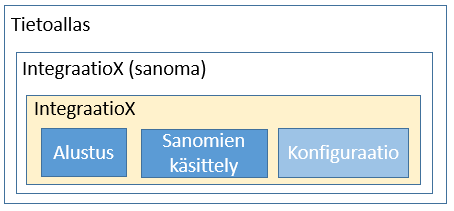
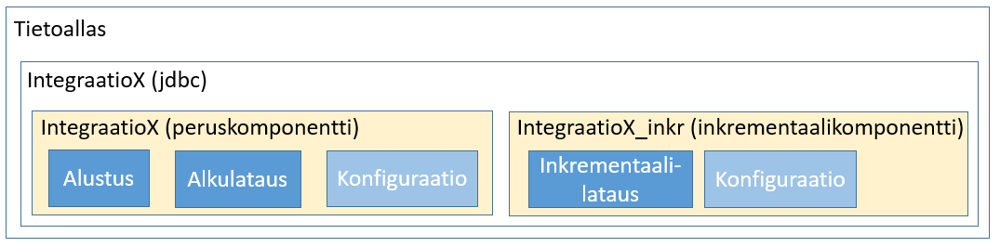
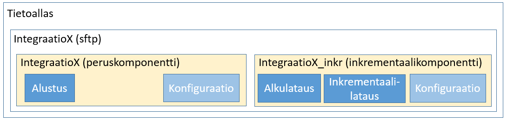
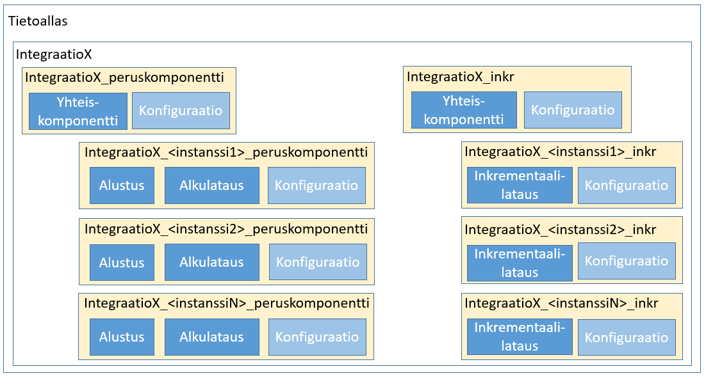

# 2.2. Integraatiot - Yleisrakenne
Tämä kappale kuvaa loogisessa arkkitehtuurissa esitetyn integraation yleisen rakenteen toteutuksen, toiminnallisuuden ja paketoinnin kannalta. Ylemmällä tasolla yksi integraatio jaetaan joko yhteen tai  kahteen komponenttiin. 
Yhden komponentin rakenne on seuraava:

#### Kuva 1: Integraatio yhdelle lähdejärjestelmäinstanssille ja yhdellä komponentilla (sanoma).

Komponentti koostuu seuraavista osista:
  1. Peruskomponentti (<Integraation nimi>, esim "Healthweb"), joka koostuu seuraavista osista: 
    1. integraation alustus, 
    2. lähdejärjestelmän lähettämän datan käsittely
    3. integraation peruskomponentin konfiguraatio
      1. Kehitysympäristön konfiguraatio
      2. Testiympäristön konfiguraatio
      3. Tuotantoympäristön konfiguraatio

Komponentin konfiguraatio määrittelee tarkemmin miten integraatio kytkeytyy lähdejärjestelmään ja Tietoalataaseen.

Kahden pääkomponentin tapauksessa toinen vastaa alustuksesta ja alkulatauksesta (jos validi kyseiselle integraatiolle) ja toinen inkrementtilatauksista. Molemmat komponentit kytkeytyvät samaan lähdejärjestelmään. Alla komponenttien esittely lyhyesti:

  1. Peruskomponentti (<Integraation nimi>, esim "QPati"), joka koostuu seuraavista osista: 
    1. integraation alustus, 
    2. integraation alkulataus ja
    3. integraation peruskomponentin konfiguraatio
      1. Kehitysympäristön konfiguraatio
      2. Testiympäristön konfiguraatio
      3. Tuotantoympäristön konfiguraatio
  2. Inkrementaalikomponentti (<Integraation nimi>_inkre, esim. "QPati_inkr"), joka asennetaan Tietoaltaaseen mikropalveluna ja joka hoitaa jatkuvat inkrementaalilataukset. Alikomponentit ovat:
    1. integraation inkrementaalilataus ja 
    2. integraation inkrementaalikomponentin konfiguraatio
      1. Kehitysympäristön konfiguraatio
      2. Testiympäristön konfiguraatio
      3. Tuotantoympäristön konfiguraatio

Molempiin komponentteihin liittyy integraatio-, asiakas- ja ympäristöspecifinen konfiguraatio, joka määrittelee esimerkiksi tietokantojen nimet, osoitteet yms. Konfiguraatio on erotetty lähdekoodista asiakasyksityisyyden ja tietoturvan takaamiseksi.

Molemmat komponenti asennetaan erikseen KayttoonOtto.md-dokumentin ohjeiden mukaisesti. Alla oleva kuva (Kuva 1) selventää yllä kuvattua yhden instanssin integraation rakennetta:

#### Kuva 1: Integraatio yhdelle lähdejärjestelmäinstanssille (jdbc).

Käytännössä GIT:ssä yhden instanssin integraatioilla on kaksi kansiota (alikansioineen): 1) Integraation nimi ilman "_peruskomponentti"-päätettä ja integraation nimi "_inkr"-päätteellä.
Yllä oleva komponenttirakenne pätee suoraan  jdbc-integraatiohin, joissa on vain yksi historia-lähdejärjestelmä ja vain yksi ilähdejärjestelmä, josta tehdään inkrementaalilatauksia. 

Sftp-pohjaisilla integraatioilla rakenne on sama, mutta toiminnallisuus komponenteilla hieman eri, sillä alkulataus tehdään samalla mekanismillä kuin inkrementalailataus (Kuva 2):

#### Kuva 2: Integraatio yhdelle lähdejärjestelmäinstanssille (sftp).

 
Jos joko historia- tai inkrementaali-instansseja on useampia, lisääntyy komponenttien määrä samassa suhteessa. Montaa instanssia tukevan integraation komponenttirakenne näyttää seuraavalta:

#### Kuva 3: Integraatio useammalle lähdejärjestelmäinstanssille.

Peruskomponentti-instanssien ja inkrementtikomponenttien-instanssien määrä ei välttämättä ole sama. Integraatiolla voi olla useampia historia-kantoja, mutta vain yksi instanssi, josta suoritetaan inkrementaalilatauksia. Joka tapauksessa yhden instanssin historia-data ja inkrementaali-data tulee olla tietomalliltaan samoja ja täten data talletetaan samaan kantaan. 

Jos historiakantojen tietomalli on sama, niin data voidaan ladata samaan kantaan ja näin peruskomponentistä luodaan vain yksi instanssi. Jos eroja löytyy liikaa, tulee jokaiselle historiakannalle luoda oma tietokanta (oma peruskomponentin instanssi).
