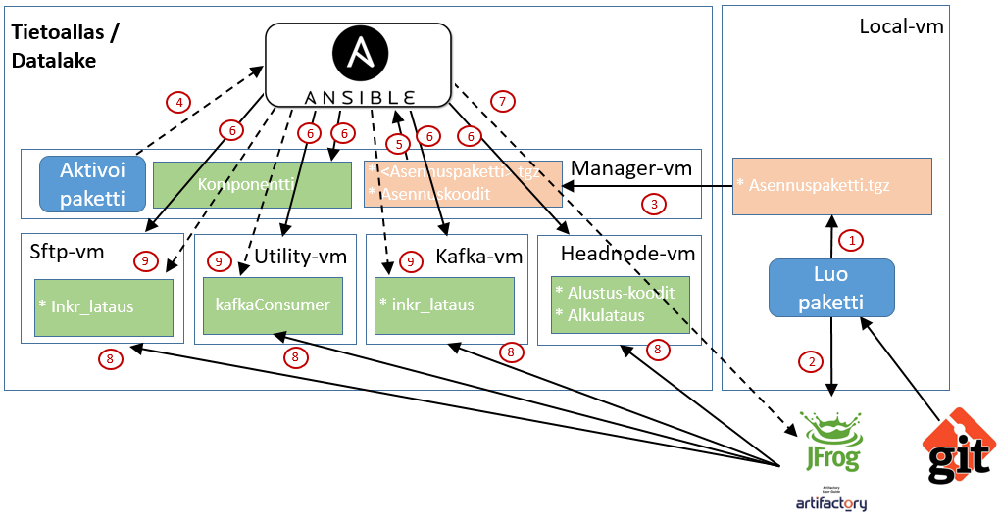

# Komponentin asennus Tietoaltaaseen

Tietoaltaan palvelininfrastruktuurin ja komponenttien asennuksen automatisointiin käytetään [Ansiblea](https://www.ansible.com/), jonka avulla järjestelmän komponentit asennetaan Managerilta keskitetysti oikeille virtuaalipalvelimille. Komponentti asennetaan Manager-nodelta komponentin **KayttoonOtto.md**-dokumentin ohjeiden mukaisesti (löytyy komponentin juurihakemistosta Manager-vm:ltä tai GIT-repositorystä). 

Kuvassa 1 on esitetty komponentin asennus yleisesti. Komponenttien asennuksessa on pieniä variaatioita, mutta KayttoonOtto.md kertoo yksityiskohtaisesti miten juuri kyseinen komponentti asennetaan. 

## Kuva 1. Komponentin asennus.

# Kuvan komponentit
Kuvan komponenttien kuvaukset löytyvät erikseen kappaleesta [Integraatiokuvien komponentit](int_komponentit.md)

# Asennuksen toiminnallisuus
Tässä kerrotaan mitä tapahtuu asennuksessa Kuvan 1 mukaan.

## 1. Asennuspaketin luonti
Käyttäjä luo paketin kehitysympäristössä. Riippuen hieman komponentista, toimenpiteet ja paketin sisältö hieman eroavat toisistaan. Paketti sisältää mm. Ansible-roolien koodit, dokumentaatiota, metadataa, skriptejä ja mahdollisesti jar-tiedoston.
Jos komponentti ei sisällä java-koodia, niin jar-tiedostoa ei luoda. Jos taas komponentti sisältää java-koodia, niin joissakin (vanhemmissa) komponenteissa jar-tiedosto sisällytetään asennuspakettiin ja joissakin (komponentit, jotka käynnistetään mikropalveluna) jar-tiedosto ladataan artifactoryyn.

## 2. Jar-tiedoston kopiointi artifactoryyn
Komponentin jar-tiedostot kopioidaan artifactoryyn. CI-automaatio hoitaa tämän automaattisesti. Manuaalisestikin latauksen voi tehdä (mvn deploy).

## 3. Asennuspaketin siirto Tietoaltaan manager-nodelle
Käyttäjä siirtää asennuspaketin (*.tgz-, tai *.tar.gz-tiedosto) manager-vm:lle manuaalisesti esim. sftp:llä tai scp:llä.

## 4. Komponentin aktivointi 
Komponentti aktivoidaan Manager-vm:llä activate.sh-komennolla. Tämä käynnistää Ansible-playbook-ajon ja asennus käynnistyy ja hoituu Ansiblen toimesta automaattisesti.

## 5. Asennuspaketin Ansible-konfiguraation luku
Ansible lukee komponentin asennuskonfiguraation ja alkaa suorittaa asennusta sen mukaan.
Komponentille on luotu erilaisia Ansible-rooleja (<komponentti>/roles), jotka Ansible asentaa asennuskonfiguraation ja Ansible-tehtävien mukaisesti (<komponentti>/roles/tasks). 

## 6. Komponenttien osien asennus Tietoaltaaseen
Ansiblen konfiguraatiossa (<komponentti>/activate.yml) on kerrottu mille noodeille mikin rooli asennetaan. Kuvassa nämä asennukset on merkitty kaikki samalla numerolla, mutta käytännössä asennus tapahtuu konfiguraation mukaisessa järjestyksessä.

## 7. Pyyntö ladata jar-tiedosto artifactorystä
Ansible kirjatuu artifactoryyn ja suorittaa komennon, jolla aloitetaan viimeisimmän/määritellyn jar-tiedoston lataus.

## 8. Jar-tiedostojen lataus artifactorystä Tietoaltaaseen
Jar-tiedostot ladataan Ansiblen ohjaamana oikeille palvelimille ja oikeisiin kansioihin.

## 9. Mikropalveluiden käynnistys
Komponenttien mikroplavelu käynnistetään Ansiblella asennuksen lopuksi halutuilla palvelimilla. Joillakin komponenteilla ajettavat ohjelmat/skriptit käynnistetään Ansiblen sijaan käsin (koskee peruskomponentteja, joilla suoritetaan alustus ja alkulataukset).

Lopputuloksena komponentti on asennettu määritellyille palvelimelle ja mahdolliset mikropalvelut käynnistetty.
