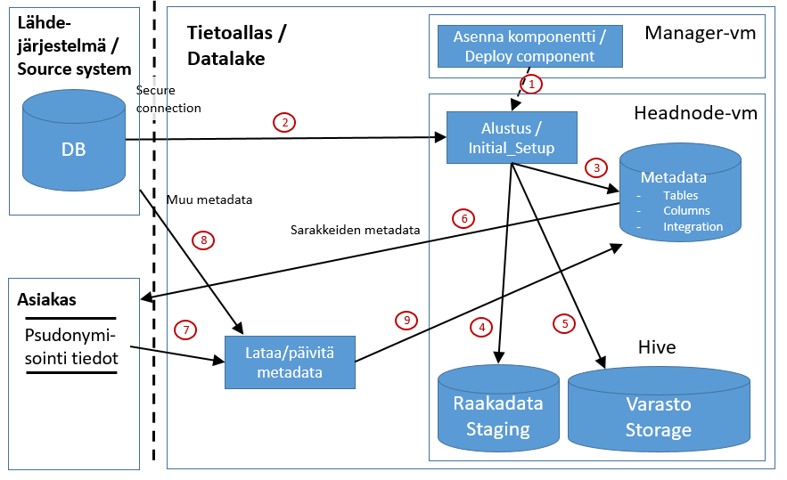

# JDBC-integraation alustus

Tämä dokumentti kertoo yleisesti mitä tapahtuu kun jdbc-perusteinen integraatio alustetaan Tietoaltaaseen. Alustus on välttämätön ennen alkulatausta ja inkrementaalilatausta. Alustuksen jälkeen Tietoaltaassa on integraatiospesifinen metadata ja hive:n tietomalli luotuna. 

Alustus tehdään manuaalisesti. Alustuksen vaiheita kuvaa alla oleva kuva:

## Kuva 1. Alustus - JDBC - integraatiot

# Kuvan komponentit
Kuvan komponenttien kuvaukset löytyvät erikseen kappaleesta [Integraatiokuvien komponentit](int_komponentit.md)

# Toiminnallisuus

## 1. Komponentin asennus (Manager - deploy component)
Integraation peruskomponenttion nimeltään "integraatio[_instanssin_nimi]".

Komponentin asennus tapahtuu seuraavien periaatteiden mukaan:
* [Komponenttien asennus](int_2_4_asennus)

Komponentti asennetaan Manager-nodelta komponentin KayttoonOtto.md-dokumentin mukaisesti (löytyy komponentin juurihakemistosta Manager-vm:ltä ja myös GIT-repositorystä)

## 2. Metadatan keruu (Initial setup)
Metadata luetaan lähdetietokannasta JDBC:n avulla. Saatu metadata vastaa täsmälleen myöhemmin siirrettävän datan datamallia. Tällä mekanismilla saadan virheetöntä ja laadukasta metdataa. Haittapuolena on, että lähdetietokannan metadata harvoin pitää sisällään taulujen ja sarakkeiden kuvauksia, joten ne tiedot tulee lähdejärjestelmän tarjota jollain muulla (mieluiten koneellisesti lluettavassa muodossa) tavalla. Käytännössä jdbc-metadata-latauksella saadaan kuitenkin pakollinen metadata integraation tekemistä varten. 

JDBC-pohjaisten integraatioden metadatan keruu tapahtuu initial_setup-proseduurin avulla (ohjeistettu käyttöohjeessa)

## 3. Metadatan lataus metadata-tietokantaan
Metadata-tiedostot ladataan lähdejärjestelmän JDBC-haun jälkeen suoraan metadata-tietokantaan.

## 4. Raakadata-altaan tietokannan ja taulujen luonti
Alustus-prosessi luo integraatiolle tietokannan ja sen taulut metadan avulla (staging_integraatio).

## 5. Varasto-altaan tietokannan ja taulujen luonti
Alustus-prosessi luo integraatiolle varasto-tietokannan ja sen taulut metadan avulla (varasto_integraatio_historia_log).

## 6. Metadatan toimitus asiakkaalle pseudonymisointia varten
Metadata-tietokannasta generoidaan csv-tiedosto, joka toimitetaan asiakkaalle pseudonymisointia varten. 

## 7. Pseudonymisointitiedon lisäys
Asiakas täyttää esim. Excelillä csv-tiedostoon sarakkeeseen pseudonymization_function arvot pseudonymisointitarpeen mukaan (PASS=Data varastoon sellaisenaan, NULL=Dataa ei siirretän varastoon, HASH=Data pseudonymisoidaan) ([Metadata - yleisesitys](03_metadata.md)). Tämän jälkeen metadata toimitetaan Tietoaltaan metadatasta vastaavalle.

## 8. Muun metadatan lataus
Alustuksen yhteydessä JDBC:llä suoraan kannasta kerätty metadata ei sisällä mitään extraa, joten metadataa täydentävä tieto tulee koostaa järjestelmään erikseen. Tämä tulisi koneellistaa mahdollisimman pitkälle ihimillisten virheiden välttämiseksi.  

## 9. Metadatan lataus metadata-tietokantaan
Pseudonymisointitiedolla ja muulla täydeentävällä päivitetyn metadatan lataus metadata-tietokantaan (update-operaatio). 

Alustuksen lopputila:
* Metadata on asennettu metadata-tietokantaan
* Pseudonymisointi-tiedot on talletettu metadata-tietokantaan
* Hive-tietokannat ja taulut on luotu hive-kantaan
