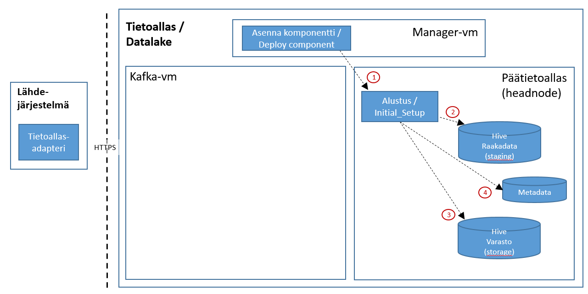

# Sanomapohjaisen-integraation alustus

Tämä dokumentti kertoo yleisesti mitä tapahtuu kun Sanoma-perusteinen integraatio alustetaan Tietoaltaaseen. Alustus on välttämätön ennen alkulatausta ja inkrementaalilatausta. Alustuksen jälkeen Tietoaltaassa on integraatiospesifinen metadata ja hive:n tietomalli luotuna. 

Alustus tehdään manuaalisesti. Alustuksen vaiheita kuvaa alla oleva kuva:

## Kuva 1. Alustus - sanoma-pohjaiset - integraatiot

# Kuvan komponentit
Kuvan komponenttien kuvaukset löytyvät erikseen kappaleesta [Integraatiokuvien komponentit](int_komponentit.md)

# Toiminnallisuus

## 1. Komponentin asennus (Manager - deploy component)
Integraation peruskomponenttion nimeltään "<integraatio>[_<instanssin_nimi>]".

Komponentin asennus tapahtuu seuraavien periaatteiden mukaan:
* [Komponenttien asennus](int_2_4_asennus.md)

Komponentti asennetaan Manager-nodelta komponentin KayttoonOtto.md-dokumentin mukaisesti (löytyy komponentin juurihakemistosta Manager-vm:ltä ja myös GIT-repositorystä)

## 2. Raakadata-altaan tietokannan ja taulujen luonti
Alustus-prosessi luo integraatiolle tietokannan ja sen taulut metadan avulla (staging_<integraatio>).

## 3. Varasto-altaan tietokannan ja taulujen luonti
Alustus-prosessi luo integraatiolle varasto-tietokannan ja sen taulut metadan avulla (varasto_<integraatio>_historia_log).

## 4. Metadatan päivitys
Status-kantaan kirjataan kafka_offset_info-tauluun sanomalukuprosessin (streamer) nimi (group_id) ja offset.

Alustuksen lopputila:
* Kafka-offset on asetettu raakadata-jonolle (<integraatio>-orig) ja pseudonymisoidulle jonolle (<integraatio>-pseudo)
* Hive-tietokannat (Raakadata ja Varasto) ja taulut on luotu hive-kantaan
