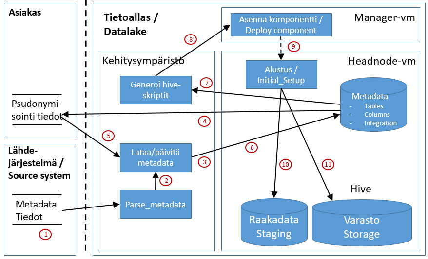

# Sftp-integraation alustus

Tämä dokumentti kertoo yleisesti mitä tapahtuu kun sftp-perusteinen integraatio alustetaan Tietoaltaaseen. Alustus on välttämätön ennen alkulatausta ja inkrementaalilatausta. Alustuksen jälkeen Tietoaltaassa on integraatiospecifinen metadata ja hive:n tietomalli luotuna. 

Alustus tehdään manuaalisesti. Alustuksen vaiheita kuvaa alla oleva kuva:

# Kuvan komponentit
Kuvan komponenttien kuvaukset löytyvät erikseen kappaleesta [Integraatiokuvien komponentit](int_komponentit.md)

# Toiminnallisuus

## 1. Metadatan keruu
Metadata pitää saada lähdejärjestelmästä koneluettavassa muodossa. Formaatteina voidaan käyttää esim. seuraavia json, XML, csv. Lähdejärjestelmädokumentaatio on todettu varsin huonolaatuiseksi, jossa on paljon inhimillisiä kirjoitusvirheitä, jotka taas aiheuttavat paljon lisätyötä integraation toimintaan saamisessa. Saatu metadata tulee olla täysin yhdenpitävää varsinaisen datan tietomallin kanssa.

## 2.  Metadatan parsinta
Metadata-tiedostot tietoaltaassa ovat csv-muotoisia tiedostoja, joissa on vaadittavat kuvaukset data-tauluille ja niiden sarakkeille. Jos metadataa ei saada lähdejärjestelmästä suoraan halutussa csv-tiedostossa, luodaan ne koneellisesti parserin avulla. Riippuen lähdedokumentistä, josta metadataa parsitaan voi koneellisen parserin tuottama data olla laadultaan varsin vaihtelevaa. Parhaimman laadun saa kun lähdejärjestelmän tuottama metadata on koneellisesti generoitu valmiiksi tietoaltaan vaatimaan formaattiin tai johonkin strukturoituun koneellisesti luettavaan formaattiin (json, xml, csv).

## 3. Metadatan lataus metadata-tietokantaan
Metadata-tiedostot ladataan ohjelmallisesti metadata-tietokantaan (Metadataloader - insert-operaatio).

## 4. Metadatan toimitus asiakkaalle pseudonymisointia varten
Metadata-tietokannasta generoidaan csv-tiedosto, joka toimitetaan asiakkaalle pseudonymisointia varten. Asiakas täyttää esim. Excelillä csv-tiedostoon sarakkeeseen pseudonymization_function arvot pseudonymisointitarpeen mukaan (PASS=Data varastoon sellaisenaan, NULL=Dataa ei siirretän varastoon, HASH=Data pseudonymisoidaan).

## 5 Pseudonymisointitiedon lisäys
Asiakas kirjaa metadataan pseudonymisoitavat kentät ([Metadata - yleisesitys](03_metadata.md)). Tämän jälkeen metadata toimitetaan Tietoaltaan metadatasta vastaavalle.

## 6. Metadatan lataus metadata-tietokantaan
Pseudonymisointitiedolla päivitetyn metadatan lataus metadata-tietokantaan (update-operaatio). Metadata-csv:t talletetaan lisäksi komponentin lähdekoodeihin.

## 7. Hive-taulujen luontiskriptit
Metadatan perusteella luodaan Hive-taulujen luonnissa käytetyt hql-skriptit ja ne talletetaan komponentin lähdekoodeihin.

## 8. Lähdekoodin tallennus ja asennuksen aloitus
Lähdekoodit talletetaan versiohallintaan (GIT) ja luodaan asennuspaketti KayttoonOtto.md-dokumentin ohjeiden mukaisesti.

## 9. Komponentin asennus (Manager - deploy component)
Integraation peruskomponentti on nimeltään "<integraatio>[_<instanssin_nimi>]". 

Komponentin asennus tapahtuu seuraavien periaatteiden mukaan:
* [Komponenttien asennus](int_2_4_asennus)

Komponentti asennetaan Manager-nodelta komponentin KayttoonOtto.md-dokumentin mukaisesti (löytyy komponentin juurihakemistosta Manager-vm:ltä ja myös GIT-repositorystä)

## 10. Raakadata-altaan alustus (latausalue, staging)
Headnode-palvelimella ajetaan raakadata-altaalle tarkoitettu alustusskripti, joka luo raakadata-altaaseen tietokannan, staging_<integraatio>, ja sen kaikki sen taulut.

## 11. Varasto-altaan alustus (storage)
Headnode-palvelimella ajetaan varasto-altaalle tarkoitettu alustusskripti, joka luo raakadata-altaaseen tietokannan, staging_<integraatio>, ja sen kaikki sen taulut.

Alustuksen lopputila:
* Metadata on asennettu metadata-tietokantaan
* Pseudonymisointi-tiedot on talletettu metadata-tietokantaan
* Hive-tietokannat ja taulut on luotu hive-kantaan
