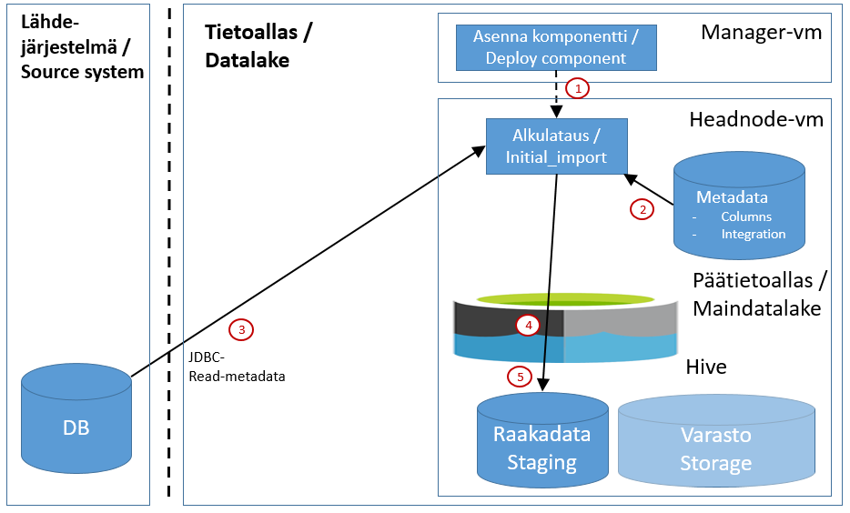
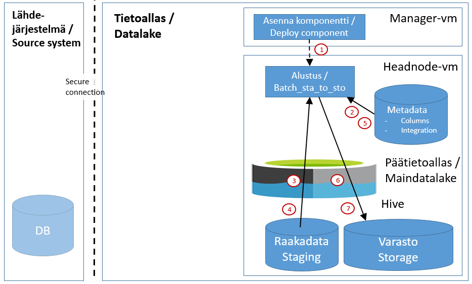
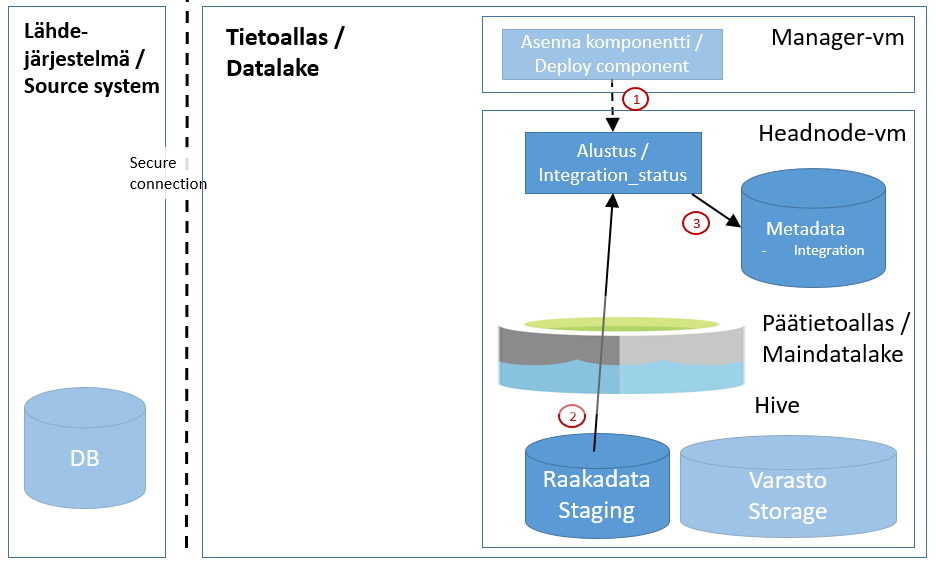

# Jdbc alkulataus
Tämä dokumentti kertoo yleisesti miten tapahtuu jdbc-pohjaisen integraation alkulataus, eli kaiken lähdejärjestelmän historiadatan lataus Tietoaltaaseen. Lähdejärjestelmälle voi olla useampia historiakantoja (tulee olla tietomalliltaan identtiset/yhteensopivat), jolloin kukin historiakanta ladataan vuorotellen Tietoaltaaseen (samaan hive-kantaan).

Alkulatausta live-järjestelmästä (samoin kuin myös inkrementaalilatauksia) tulee välttää. Suositeltavinta on käyttää lähdejärjestelmän arkisto-/raportointikantaa. 

Alkulatausta tarvitsee suorittaa yleensä vain yhden kerran integraation elinkaaren aikana. Poikkeuksena voi olla esimerkiksi järjestelmäpäivitys, jossa tietomalli muuttuu liiaksi ja integraatio tulee asentaa ns. puhtaalta pöydältä ja täten alkulataus tulee tehdä uudelleen.

Jos järjestelmä on ollut vuosia käytössä, alkulatauksessa datamäärät ovat paljon suurempia kuin inkrementaalilatauksissa. Tästä johtuen tulee alkulataus suunnitella hyvin ja toteuttaa käsin ja valvotusti, jotta datan lataus lähdejärjestelmästä ei haittaa lähdejärjestelmää, eikä Tietoallasta liiaksi latauksen aikana. Jdbc-alkulataus kuormittaa lähdejärjestelmää periaatteessa "yhden uuden (read-only) käyttäjän" verran, sillä lataus suoritetaan taulu kerrallan yhdellä tietokantayhteydellä. 

Alkulataus saattaa kestää koko tietokannalle useita päiviä. Jos lähdejärjestelmässä on rajoituksia alkulatauksen ajankohdalle tai kestolle (esim. live-järjestelmän ja arkisto-kannan synkronoinnin sykli ja sen aikana tietokantayhteyksien katkeaminen tietokannan käyttäjiltä), niin alkulataus voidaan joutua pilkkomaan useampaa osaan. 

Alkulataus on jaettu kolmeen vaiheeseen:

A. Alkulataus raakadata-altaaseen

B. Datan prosessointi varasto-altaaseen

C. Integraatio-metadatan alustus inkrementtilatauksia varten

Jako eri vaiheisiin on tehty käytännön syistä - alkulataus raadadata-altaaseen voidaan suorittaa erikseen nopeammin ja näin voidaan minimoida vaikutukset lähdejärjestelmään. Varastoprosessointi voidaan hoitaa lähdejärjestelmäriippumattomasti. 

# A.  Alkulataus raakadata-altaaseen

Alkulataus lähdejärjestelmästä raakadata-altaaseen tapahtuu alla olevan kuvan (Kuva 1) mukaisesti:

#### Kuva 1.

## Komponentit
Kuvassa näkyvät komponentit kuvataan kappaleessa [Integraatiokuvien komponentit](int_komponentit.md)

## Toiminnallisuus
Tässä osassa kerrotaan yllä olevan kuvan toimintaperiaate. Alla olevat numerot viittaavat kuvan punaisiin ympäröityihin numeroihin. Konkreettiset suoritusohjeet alkulatauksen tekemiseen sisältyvät dokumenttiin KayttoonOtto.md.

#### A.1. Komponentin asennus (Manager - deploy component)
Integraation alkulataukseta vastaava komponentti on nimeltään "<integraation_nimi>[_<instanssin_nimi>]". Komponentin asennus tapahtuu seuraavien periaatteiden mukaan:

* [Komponenttien asennus](int_2_4_asennus.md)

Jokainen komponentti asennetaan Manager-nodelta komponentin KayttoonOtto.md-dokumentin mukaisesti (löytyy komponentin juurihakemistosta GIT-repositorystä). Jdbc-integraatioiden latauskomponentti asennetaan Headnode-palvelimelle.

#### A.2. Metadatan luku 
Ennen alkulatausta luetaan integration_status-taulusta lista tauluista, joista alkulataus tehdään. Alkulataus suorittaa latauksen vain niistä tauluista, joissa arvona on jotain muuta kuin "EXCLUDE". Tällä tavalla voidaan hallita mistä tauluista alkulataus suoritetaan. Esimerkiksi lataus voidaan suorittaa useammassa vaiheessa siten, että jokaisessa vaiheessa on laskennallisesti sama määrä rivejä siirrettävänä. Tällä tavoin voidaan myös ladata vaikka vain yhden taulun datat lähdejärjestelmästä.  

#### A.3. Alkulataus lähdejärjestelmästä 
Tietoaltaan latausprosessi lukee lähdejärjestelmän tauluista kaiken sillä hetkellä olevan datan ja lataa sen suojatulla yhteydellä Tietoalataaseen (secure jdbc/sql) . Lukeminen ja lataus suoritetaan taulu kerrallaan.

#### A.4. Raaka-datan tallennus Azuren DataLake Storeen (Utility - kConsumer)
Latausprosessi tallentaa Kafkasta lukemansa datan ensin Azure DataLake Storeen [ORC](https://orc.apache.org/docs/)-formaattiin. Talletettu data on nähtävissä Azuren portalin kautta integraatiospecifisessä kansiossa (/cluster/maindatalake/staging/<integraatio>). Alkulatauksen tiedostot on integraation juurikansiossa. Suuren taulun latauksen etenemistä voi seurata Azure portaalista Data-Explorerilla ym. kansiosta - eli tiedoston koko ja muokkausaika muuttuu ajan funktiona. Jos nämä tiedot ei päivity, on alkulataus keskeytynyt virheeseen. 

#### 5. Datan tallennus raakadata-altaaseen (Headnode, Hive - Raakadata/Staging)
Lataus-prosesi kirjoittaa datan DataLake Storen lisäksi hiven raakadata-altaaseen sellaisenaan ("raakana"), eli sitä ei prosessoida mitenkään. Hivessä data on talletettuna relaatiotietokannan mukaisesti tauluihin. Hiven:n tietokannan nimi on "staging_<integraatio>". Dataa voi tarkastella Hiven CLI-sovellusilla (esim. [Beeline](https://cwiki.apache.org/confluence/display/Hive/HiveServer2+Clients#HiveServer2Clients-Beeline–CommandLineShell)) hql-kyselyiden avulla. Data näkyy hive:n taulussa vasta kun koko taulun sisältö on ladattu Tietoaltaaseen.

# B. Datan prosessointi varasto-altaaseen

Datan prosessointi raakadata-altaasta varastoon kannattaa suorittaa vasta kun edellinen vaihe on suoritettu loppuun. Tätäkin vaihetta voidaan ohjata integraatiometadatan avulla (status-kannan taulu integration_status) - taulut, jotka halutaan poissulkea prosessoinnista merkitään kenttään parameter_type arvoksi "EXCLUDE".
HUOM! Muista päivttää taulujen parameter_type prosessoinnin lopuksi normaaliarvoon (kopio parameter_type-kenttään kentän orig_parameter_type arvo).

Prosessointi tapahtuu alla olevan kuvan 2 mukaisesti:

#### Kuva 2. Datan prosessointi varasto-altaaseen

## Komponentit
Kuvassa näkyvät komponentit kuvataan kappaleessa [Integraatiokuvien komponentit](int_komponentit.md)

## Toiminnallisuus
Tässä osassa kerrotaan yllä olevan kuvan toimintaperiaate. Alla olevat numerot viittaavat kuvan punaisiin ympäröityihin numeroihin. 

Konkreettiset suoritusohjeet varastoon prosessoinnin tekemiseen sisältyvät dokumenttiin KayttoonOtto.md. Siellä on myös kirjattu riippuvuudet muihin komponentteihin, jotka tulee olla asennettuna ennen kuin varastoonprosessointia voi aloittaa. 

#### B.1. Komponentin asennus (Manager - deploy component)
Komponentti on asennettu jo kohdassa A.1.,joten asennusta ei tarvitse suorittaan. 

#### B.2. Integraatio-metadatan luku
Prosessi lukee metadata-kannasta tiedot mitkä taulut halutaan prosessoida. 

#### B.3. Datan luku Azure Datalake storesta
Data luetaan tiedosto Azure Datalake storesta.

#### B.4. Datan luku hive-kannasta
Data luetaan data hive-kannasta. Käytännössä data on fyysisesti ORC-tiedostoissa Datalake storessa, joten kannasta lukua ei sinänsä tapahdu kuin "konseptuaalisesti". BigData järjestelmässähän 

#### B.5. Pseudonymisointi-tiedon luku metadatakannasta
Raaka-data pseudonymisoidaan ennen sen tallentamista varastoon ja tässä vaiheessa prosessi lukee taulu ja sarakekohtaisen pseudonymoisnti-tiedon metadatakannasta.

#### B.6. Varasto-datan prosessointi Azuren DataLake Storeen (Headnodem Päätietoallas)
Prosessi tallentaa raakadata-altaasta lukemansa ja pseudonymisoidun datan myös DataLake Storeen [ORC](https://orc.apache.org/docs/)-formaattiin. Talletettu data on nähtävissä Azuren portalin kautta integraatiospecifisessä kansiossa (/cluster/maindatalake/storage/<integraatio>). 

#### B.7. Datan tallennus varastoaltaaseen (Utility, Päätietoallas, Hive - Varasto/Storage)
Prosessi tallentaa pseudonymisoidun datanvastastoaltaaseen. Hiven:n tietokannan nimi on "varasto_<integraatio>_historia_log". Dataa voi tarkastella Hiven CLI-sovellusilla (esim. [Beeline](https://cwiki.apache.org/confluence/display/Hive/HiveServer2+Clients#HiveServer2Clients-Beeline–CommandLineShell)) hql-kyselyiden avulla. 

# C. Integraatio-metadatan alustus inkrementtilatauksia varten
Alkulatauksen spark-prosessi ei kirjaa integraation status-kantaan alkulatauksen jälkeen lataustilannetta, vaan status-kannan päivittäminen tehdään erikseen omalla prosessilla.

Integraation status-taulun alustus menee seuraavasti (Kuva 3)

#### Kuva 3. Integraation status-taulun alustus.

## Komponentit
Kuvassa näkyvät komponentit kuvataan kappaleessa [Integraatiokuvien komponentit](int_komponentit.md)

## Toiminnallisuus
Tässä osassa kerrotaan yllä olevan kuvan toimintaperiaate. Alla olevat numerot viittaavat kuvan punaisiin ympäröityihin numeroihin. 

Konkreettiset suoritusohjeet varastoon prosessoinnin tekemiseen sisältyvät dokumenttiin KayttoonOtto.md.  

#### C.1. Komponentin asennus (Manager - deploy component)
Komponentti on asennettu jo kohdassa A.1.,joten asennusta ei tarvitse suorittaan. 

#### C.2. Alkulatauksen jälkeisen tilanteen luku
Prosessi lukee taulun (tehdään jokaiselle taululle) latauksen jälkeisen tilanteen. Riippuen latausmenetelmästä , luetaan seuraavat tiedot:
* FULL_TABLE: ei tarvetta inkrementaalilogiikalle - ei lueta mitään tietoja
* TIME_COMPARISON: taulun aikaleima, jolla viimeisin rivin on ladattu. 
* HISTORY_TABLE_LOOKUP: max(avain_id) arvo, talletetuista riveistä. 

#### C.3. Integraation status-metadatan tallentaminen metadata-kantaan
Raakadata-kannasta luetut arvot talletetaan status.integration_status-tauluun:
* FULL_TABLE: ei talleteta mitään
* TIME_COMPARISON: aikaleima kenttään status.integration_status.time_column
* HISTORY_TABLE_LOOKUP: avain_id kenttään status.integration_status.key_column

Kun edellä mainitut tiedot on haettu taulukohtaisesti ja ne on kirjattu integration_status-tauluun, niin inkrementtilataus osaa tämän jälkeen jatkaa latauksia oikeasta kohdasta.
