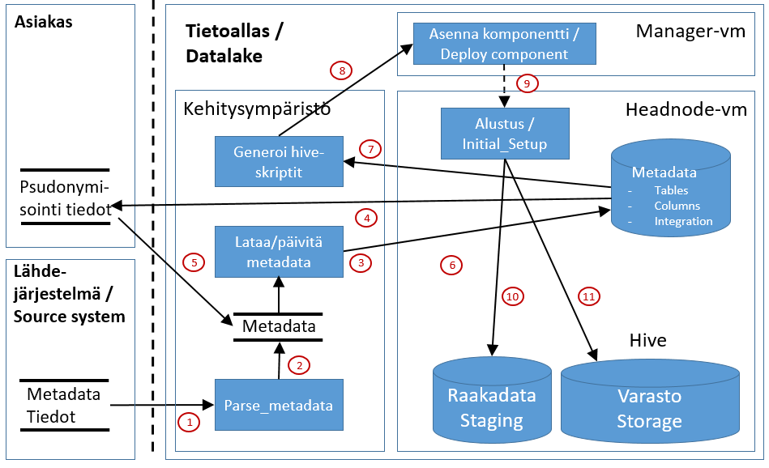

# SFTP/Kafka alkulatauksen yleiskuvaus
Tämä dokumentti kertoo yleisesti miten tapahtuu sftp-pohjaisen integraation alkulataus, eli kaiken lähdejärjestelmän historiadatan lataus Tietoaltaaseen.

Jos järjestelmä on ollut vuosia käytössä, alkulatauksessa datamäärät ovat paljon suurempia kuin inkrementaalilatauksissa. Tästä johtuen tulee alkulataus suunnitella hyvin ja toteuttaa käsin ja valvotusti, jotta tiedostojen koko ja datan määrä ei kaada/tuki koko integraatioputkea. 

Maksimikooksi yhdelle yksittäisellä käsiteltävälle data-tiedostolle on määritelty 300MB. Tämä tarkoittaa sitä, että useamman vuoden historiadata tulee pilkkoa esim. vuosi/kuukausi-tasoilla tätä pienempiin tiedostoihin. Tämä rajoitus mielessä pitäien alkulataus lähdejärjestelmästä tietoaltaaseen tapahtuu alla olevan kuvan mukaisesti:

## Komponentit
Kuvassa näkyvät komponentit kuvataan kappaleessa [Integraatiokuvien komponentit](int_komponentit.md)

# Toiminnallisuus
Tässä osassa kerrotaan yllä olevan kuvan toimintaperiaate. Alla olevat numerot viittaavat kuvan punaisiin ympäröityihin numeroihin.

## 1. Komponentin asennus (Manager - deploy component)
Integraation alkulataukseta vastaava komponentti on nimeltään "integraation_nimi". Komponentin asennus tapahtuu seuraavien periaatteiden mukaan:

* [Komponenttien asennus](int_2_4_asennus.md)

Jokainen komponentti asennetaan Manager-nodelta komponentin KayttoonOtto.md-dokumentin mukaisesti (löytyy komponentin juurihakemistosta GIT-repositorystä). Jdbc-integraatioiden latauskomponentti asennetaan Headnode-palvelimelle.

## 2. Datan poiminta ja siirto (Lähdejärjestelmä - Uploader )
Lähdejärjestelmä poimii alkulatausdatan tietojärjestelmästä, tallentaa sen valittuun dataformaattiin ja siirtää tietoaltaan sftp-palvelimelle. Alkulatauksessa kaikki alkulatauksen tiedostot kannattaa siirtää tietoaltaan puolelle ennen varsinaisen datan prosessoinnin aloittamista. 

## 3. Ladattujen tiedostojen prosessointi (Sftp - kProducer)
Kafka producer tarkkailee kansiota, johon lähdejärjestelmä siirtää tiedostot.
Tiedostojen käsittelyä voidaan hallita Tietoaltaan puolella siirtämällä tiedostoja varsinaiseen latauskansioon lataussuunnitelman mukaisesti siten, että järjestelmän stabiili toiminnallisuus varmistetaan.
Tiedostoformaatti vaihtelee eri integroinneissa ja tiedoston luku levyltä ja transformaatio Kafkan dataformaattiin tapahtuu tässä vaiheessa.  

## 4. Datan syöttö Kafkalle (Sftp - kProducer)
kProducer syöttää ladatun datan Kafkalle oikealle Topicille (integraatiokohtainen) [Avro](https://avro.apache.org/)-formaatissa. 

## 5. Datan luku Kafkasta (Utility - kConsumer)
Geneerinen kConsumer käy määräajoin (konfiguroitavissa) tarkastamassa onko sen seuraamaan Topic:iin (1-n) on saapunut uutta dataa. 
 
## 6. Raaka-datan prosessointi Azuren DataLake Storeen (Utility - kConsumer)
kConsumer tallentaa Kafkasta lukemansa datan ensin Azure DataLake Storeen [ORC](https://orc.apache.org/docs/)-formaattiin. Talletettu data on nähtävissä Azuren portalin kautta integraatiospecifisessä kansiossa (/cluster/maindatalake/staging/<integraatio>). Alkulatauksen tiedostot on integraation juurikansiossa ja ikrementtien data alihakemistossa "inc". 

## 7. Datan tallennus raakadata-altaaseen (Headnode, Hive - Raakadata/Staging)
kConsumer kirjoittaa datan DataLake Storen lisäksi raakadata-altaaseen sellaisenaan. Hivessä data on talletettuna relaatiotietokannan mukaisesti tauluihin. Hiven:n tietokannan nimi on "staging_<integraatio>". Dataa voi tarkastella Hiven CLI-sovellusilla (esim. [Beeline](https://cwiki.apache.org/confluence/display/Hive/HiveServer2+Clients#HiveServer2Clients-Beeline–CommandLineShell)) hql-kyselyiden avulla. 

## 8. Datan pseudonymisointi
kConsumer päättelee integraation metadatan perusteella mikä data tulee pseudonymisoida, mikä data poistetaan ja mikä talletetaan varastoon sellaisenaan.

## 9. Varasto-datan prosessointi Azuren DataLake Storeen (Utility - kConsumer, Päätietoallas)
kConsumer tallentaa Kafkasta lukemansa ja pseudonymisoidun datan myös Azure DataLake Storeen [ORC](https://orc.apache.org/docs/)-formaattiin. Talletettu data on nähtävissä Azuren portalin kautta integraatiospecifisessä kansiossa (/cluster/maindatalake/storage/<integraatio>). Alkulatauksen tiedostot on integraation juurikansiossa ja ikrementtien data alihakemistossa "inc". 

## 10. Datan tallennus varastoaltaaseen (Utility, Päätietoallas, Hive - Varasto/Storage)
Pseudonymisoinnin jälkeen data talletetaan vastastoaltaaseen. Varastoaltaan tietomalli on sama kuin raakadata-altaassa. Hivessä data on talletettuna relaatiotietokannan mukaisesti tauluihin. Hiven:n tietokannan nimi on "varasto_integraatio_historia_log". Dataa voi tarkastella Hiven CLI-sovellusilla (esim. [Beeline](https://cwiki.apache.org/confluence/display/Hive/HiveServer2+Clients#HiveServer2Clients-Beeline–CommandLineShell)) hql-kyselyiden avulla. 
