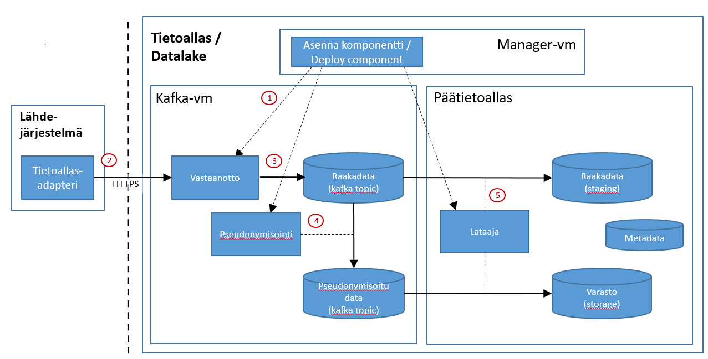

# Sanomapohjaisen inkrementaalilatauksen yleiskuvaus
Tämä dokumentti kertoo yleisesti mitä tapahtuu kun tietoaltaaseen vastaanotetaan dataa lähdejärjestelmästä sanomina ja talletetaan se ensin Kafka-putkeen ja sitten Hiven tietokantaan.

Tiedon siirtyminen lähdejärjestelmästä tietoaltaaseen tapahtuu alla olevan kuvan mukaisesti:

* 

Kuvan komponentit ja toiminnallisuus on kuvattu alla olevissa kappaleissa.

## Komponentit
Kuvassa näkyvät komponentit kuvataan kappaleessa [Integraatiokuvien komponentit](int_komponentit.md)

# Toiminnallisuus
Tässä osassa kerrotaan yllä olevan kuvan toimintaperiaate. Alla olevat numerot viittaavat kuvan punaisiin ympäröityihin numeroihin. Konkreettiset suoritusohjeet alkulatauksen tekemiseen sisältyvät dokumenttiin KayttoonOtto.md.

#### 1. Komponentin asennus
Sanomapohjainen integraatio tarvitsee seuraavat kolme komponenttia toimiakseen 

1) vastaanotto-, 
2) pseudonymisointi- ja 
3) lataaja-komponentti.

Näistä lataaja-komponentti on puhtaasti integraatiospesifinen ja asentuu integraatiokomponentin mukana.

Asennus hoituu asennusautomaation toimesta.

Kunkin komponentin KayttoonOtto.md ohjeistaa miten se otetaan käyttöön.

#### 2. Sanomien lähetys ja vastaanotto
Lähdejärjestelmä lähettää sanomia jatkuvana sanomavirtana vastaanotto-komponentille.

#### 3. Datan talletus Raakadata-jonoon
Vastaanotto-komponentti kirjoittaa sanomat sellaisenaan tai pienin muokkauksin raakadatajonoon (kafka topic).

#### 4. Datan pseudonymisointi
Pseudonymisointi-komponentti (stream-pseudonymizer) tuottaa raakadatajonosta pseudonymisoitua versiota (kafka topic).

#### 5. Datan lataus Azure Datalake Storeen ja Hiveen
Lataaja-komponentti (stream-to-hdfs) kirjoittaa viestijonot tietoaltaaseen (Raakadata- ja varastoaltaat).
